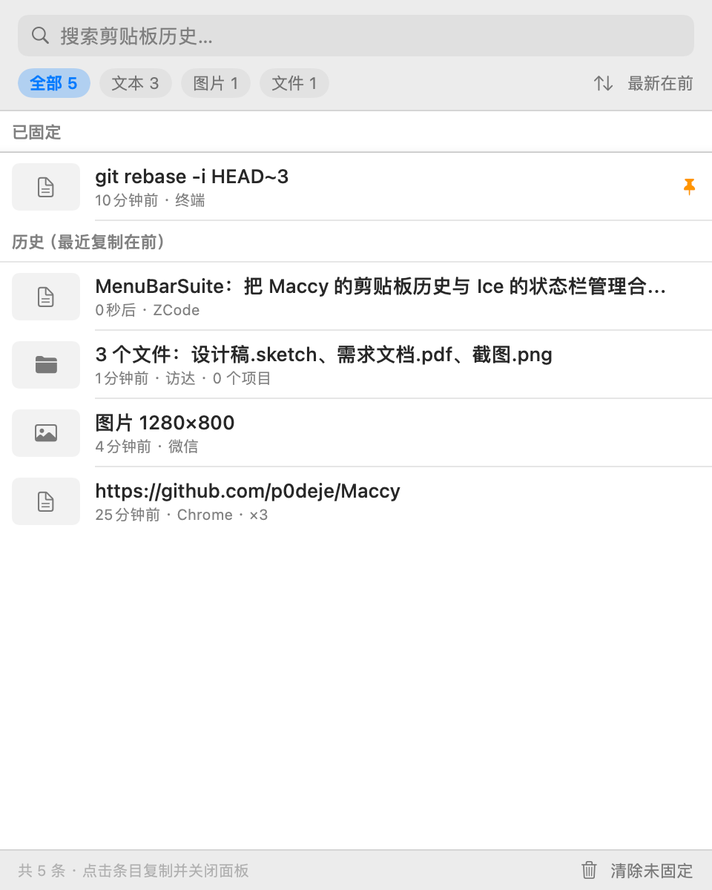
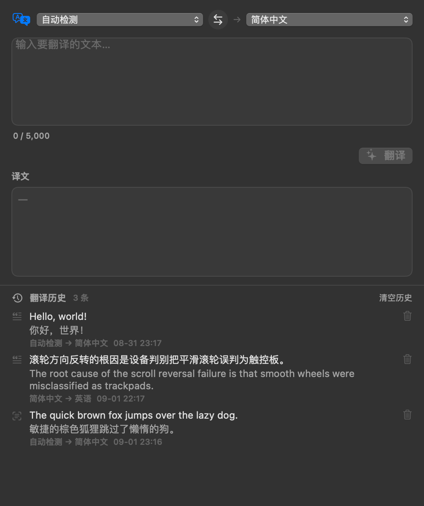
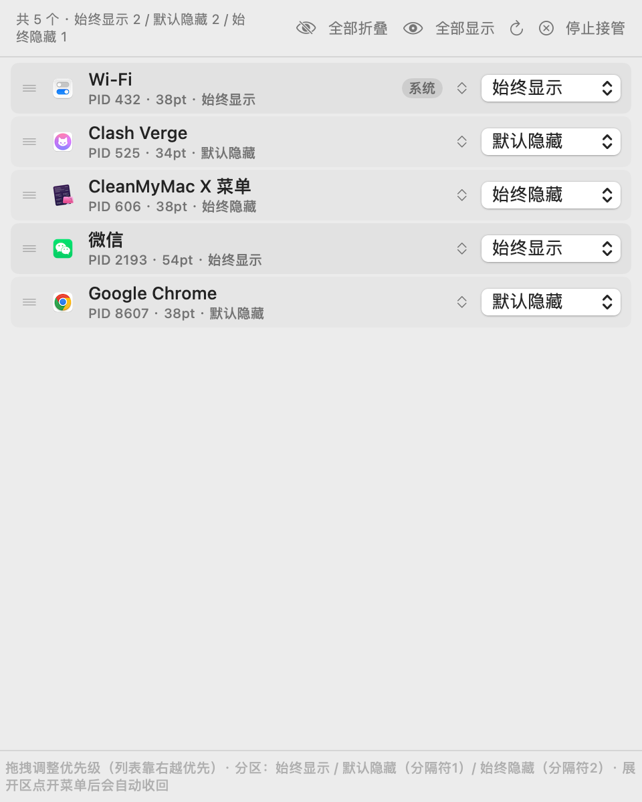

# MacTools

**MacTools** 是一个原生 macOS 菜单栏工具合集，六大能力合一：

- **历史剪贴板管理**（参考 [Maccy](https://github.com/p0deje/Maccy)）：实时记录所有复制操作（文本 / 图片 / 文件），支持搜索、筛选、排序、固定收藏与自动清理，点击即重新复制。
- **AI 翻译**（截图翻译 + 文本翻译）：框选屏幕区域自动 OCR 识别并翻译，浮窗展示一键复制；文本翻译支持自动检测与手动选择语言；兼容 OpenAI / DeepSeek / 智谱 GLM / Moonshot / 本地 Ollama，内置超时、重试与历史记录。
- **状态栏应用收缩**（参考 [Ice](https://github.com/jordanbaird/Ice)）：识别菜单栏中的应用图标，一键折叠到隐藏区、按需展开，支持拖拽调整显隐优先级，随时一键还原。
- **滚轮方向反转**（参考 [Scroll Reverser](https://github.com/pilotmoon/Scroll-Reverser)）：独立反转外接鼠标滚轮方向且不影响触控板自然滚动，按设备类型分别配置，全局即时生效。
- **区域截图与标注**（参考 Snipaste / CleanShot 交互）：快捷键框选任意区域，实时调整尺寸，截图后浮动工具栏支持固定置顶、复制、丢弃与画笔/箭头/文字/马赛克标注。
- **触摸板边缘控制**：单指在左边缘停留后上下滑动调节屏幕亮度，右边缘调节当前系统输出音量；支持边缘宽度与灵敏度设置。

使用 **Swift + SwiftUI + AppKit** 构建，无任何第三方依赖；纯本地运行，不上传任何数据（翻译功能仅将所选文字发送到你自己配置的 AI 服务）。

| 剪贴板历史 | 文本翻译（深色） | 菜单栏图标管理 |
| --- | --- | --- |
|  |  |  |

---

## 功能特性

### 剪贴板历史（Maccy 风格）

- **实时监听**：0.5 秒轮询 `NSPasteboard.changeCount`（Maccy 同款低开销方案），自动记录文本、图片（PNG 落盘）、文件（多选）三类内容，并记录来源应用与复制次数。
- **搜索与筛选**：按关键词全文搜索；按类型（全部 / 文本 / 图片 / 文件）筛选；按复制时间正序 / 倒序排列；固定条目独立分区始终置顶。
- **点击即复制**：点击任意条目重新写入系统剪贴板（去重上移、次数 +1），可选「点击后自动粘贴到前台应用」。
- **固定 / 收藏**：常用条目可固定，不受清理策略影响。
- **自动清理策略**：历史上限（100 ~ 不限制）+ 按保留天数自动清理（1 ~ 365 天，或永不），退出可选保留固定条目。
- **隐私保护**：默认忽略 1Password / Bitwarden / KeePassXC / 钥匙串等敏感应用，支持自定义忽略名单。
- **全局快捷键**：默认 `⌥⇧V` 呼出 / 收起面板（刻意与 Maccy 的 `⌘⇧V` 错开），可在设置中录制自定义组合。采用与 Maccy（KeyboardShortcuts 库）相同的 Carbon `RegisterEventHotKey` 系统热键：**不需要任何隐私权限**，聚焦其他应用时同样触发，命中组合被系统吞掉、不会传给前台应用；组合被其他工具占用时设置中会提示更换。

### 菜单栏图标管理（Ice 式三段分区）

- **识别图标**：通过 `CGWindowList` 扫描状态栏窗口（layer 25），展示名称、进程、宽度，并区分系统图标（控制中心等）。
- **三段分区**（Ice 同款）：每个图标归属「始终显示 / 默认隐藏 / 始终隐藏」之一；菜单栏布局自右向左为 `[始终显示] 分隔符1 [默认隐藏] 分隔符2 [始终隐藏]`，两个分隔符各自独立展开 / 收起对应分区，展开时高亮。
- **自动收回**：展开折叠区后点开某个图标的菜单，菜单关闭时自动收回折叠区（通过 AX `kAXMenuClosedNotification` 监听，Ice 同款机制）。
- **自动监听**：接管期间每 2 秒轻量扫描窗口集合，新出现的图标自动纳入管理、消失的自动移除，无需手动「重新扫描」（仍保留手动按钮）。
- **拖拽调整优先级**：功能窗口列表支持拖拽排序（附上下微调按钮），列表顺序即区内布局顺序（靠右越优先）。
- **随时还原**：停止接管或退出应用时，所有图标自动回到自然位置；重启应用后若上次处于接管状态会自动恢复；旧版数据（hidden 布尔）自动迁移为分区。
- **实现原理**：与 Ice 相同的思路——用私有符号 `_AXUIElementGetWindow` 把状态栏窗口映射到 AXUIElement，再通过 `kAXPositionAttribute` 移动窗口实现折叠（隐藏图标被移到屏幕外的收纳区）。**需要辅助功能权限**。

### 滚轮方向反转（Scroll Reverser 风格）

- **按设备类型独立控制**：鼠标滚轮默认反转，触控板默认关闭、保持系统「自然滚动」不变；两类设备各自独立开关。设备判别为 Scroll Reverser 的完整启发式：离散滚动判为鼠标；连续滚动结合「两指触摸手势（被动只读 tap 监听）+ 惯性相位」区分——触控板滚动必伴两指触摸，**妙控鼠标 / 罗技 MX 等平滑滚轮鼠标自动归入鼠标**；信息不足时沿用上次判定。另提供「平滑滚轮强制按鼠标处理」进阶开关兜底。
- **实时启停**：总开关基于 `CGEventTapEnable` 实现，切换毫秒级生效，无需重启本工具或系统。
- **全局生效**：活动 tap 挂在会话层（`.cgSessionEventTap`，tail-append，Scroll Reverser 同款），对所有应用的全局滚动生效；改写顺序为 Delta → FixedPt → Point 并同步改写 IOHID 层增量（避免丢失平滑滚动）；未命中的事件原样放行。
- **可选横向反转**：开启反转的设备可同时反转水平滚动。
- **持久化**：总开关与设备偏好自动保存（UserDefaults），重启后恢复上次状态；tap 运行在独立线程 RunLoop，被系统超时禁用时会自动重新启用。
- **权限**：需要「辅助功能」权限；未授权时引擎进入等待态并每秒轮询，用户在系统设置勾选后**自动恢复运行、无需重启应用**。部分 macOS 版本还需「输入监控」权限（面板中有状态提示与一键请求），否则 tap 可能收不到事件。

### 区域截图与标注

- **快捷键框选**：默认 `⌥⇧S` 触发，多屏支持；拖拽画出选区后进入调整态，8 个边角手柄可实时调整大小、选区整体可拖动，实时显示尺寸标签；回车 / 双击确认，Esc 取消。
- **截图后浮动工具栏**：截图完成后在截取位置弹出预览 + 两行工具栏：
  - **固定显示最上面**（`⌥⇧P`）：以贴图形式悬浮于所有窗口之上，可拖动，随时点 × 关闭；
  - **复制到剪贴板**（`⌥⇧C`）：写入 TIFF + PNG 双格式；
  - **取消并丢弃**（`⌥⇧X` 或 Esc）：直接关闭不保存；
  - **标记编辑**：画笔、箭头、文字、马赛克四种工具 + 五色调色板，支持撤销与清空，标注完成后再执行固定或复制。
- **标注引擎**：标注与底图共用同一条 CGContext 绘制路径（预览 = 导出，所见即所得）；马赛克为底图局部降采样像素化，效果真实。
- **快捷键自定义与冲突检测**：设置 → 截图中可为触发及三项操作录制组合；与本工具其他快捷键或常见系统快捷键（⌘C / ⌘⇧4 等）重复时立即给出橙色提示。
- **操作反馈**：每步操作（复制成功 / 失败、固定、丢弃、权限缺失）都有底部 HUD 提示。
- **权限**：需要「屏幕录制」权限（截屏内容读取），未授权时面板与 HUD 引导跳转系统设置。

### AI 翻译（截图翻译 + 文本翻译）

- **截图翻译**：全局快捷键 `⌥⇧T`（可自定义）或菜单栏右键触发 → 框选屏幕区域 → 本机 Vision OCR 识别文字 → 调用 AI 翻译 → **浮窗气泡**展示在截取区域附近。浮窗含原文折叠、译文突出、一键复制译文；识别中 / 翻译中有加载态，**无文字或识别失败给出明确提示**（"截图中未识别到文字"等），Esc 或 × 关闭。
- **文本翻译**：菜单栏右键 → 文本翻译，独立窗口。源语言支持**自动检测与手动选择**（15 种常用语言），目标语言自由切换，一键互换语言对；`⌘↩` 或按钮翻译；译文**一键复制 / 一键清空**；输入超 5000 字符时红框 + 计数 + 明确提示并禁用翻译按钮。
- **统一 AI 服务层**：兼容 OpenAI Chat Completions 协议，内置 **OpenAI / DeepSeek / 智谱 GLM / Moonshot / Ollama（本地）一键预设**，也可自定义地址与模型；API 密钥仅保存在本机；设置页提供**测试连接**。请求**超时可调**（5~120 秒）、失败**自动重试**（0~3 次，指数退避，仅对超时/限流/网络/5xx 重试）、网络异常与服务端错误均有**友好中文提示**；「测试连接」成功 / 失败内联反馈。
- **翻译历史**：本地 JSON 保存（原文、译文、语言对、时间戳、来源），文本翻译窗口内查看、逐条删除、一键清空，上限可调（20~500 条），同文同语言对去重置顶。
- **共用接口**：截图翻译与文本翻译走同一 `TranslationService`，行为与错误提示一致。
- **明暗适配**：全部界面使用系统语义色，深色模式自动适配。
- **隐私**：文字识别在本机完成；仅将识别 / 输入的文本发送到你自己配置的 AI 服务。

### 触摸板边缘控制

- **入口**：菜单栏图标右键 →「触摸板边缘控制…」。默认关闭，开启后按提示授予辅助功能权限，授权后自动开始监听。
- **使用**：单指从最左侧 / 最右侧边缘落下，停留约 0.2 秒，再上下滑动。上滑增加、下滑降低，抬手结束。默认每侧宽度为触摸板的 15%，可调 8%～25%；灵敏度可调 0.5～2 倍。
- **防误触与光标**：从中间滑入边缘不触发；没有停留、横向移动、点击、多指操作均取消本次控制，直到全部抬手后才重新识别。停留确认后锁住当时的光标位置，硬件层拦截移动事件并保持位置，应用在后台也生效；抬手、点击、断流、关闭功能及退出时释放。两指滚动仍走系统及已有滚轮方向设置。
- **系统提示**：每次亮度 / 音量调整成功后，通过系统 `OSD.framework` 显示 macOS 原生浮层；不再使用普通成功提示。另在光标所在屏幕底部居中显示当前参数，如「屏幕亮度：10%」或「声音：10%」，数值来自实际调节结果。提示避开 Dock、不抢焦点、不拦截鼠标，连续调节时原位更新，抬手约 0.9 秒后淡出。系统提示接口不可用时，面板会说明，调节功能仍可使用。
- **亮度与音量**：优先控制内置屏幕，没有内置屏幕时尝试首个屏幕；最低亮度保留 5%。音量作用于当前默认输出设备，不会切换到扬声器；静音时上滑从低音量开始恢复。普通 DDC/CI 外接显示器及无法软件调音量的 HDMI / 数字输出暂不支持，会显示提示。
- **设备与生命周期**：同时监听内置和外接触摸板，面板显示两类设备数量；每块设备独立识别手势，一次只由一块设备控制，另一块设备的移动或抬手不会打断调节；关闭功能和退出应用时注销回调，睡眠时停止、唤醒后重连。新增触摸板或重新插拔后可点「重新连接触摸板」。
- **实现与兼容性**：`TrackpadFeature` 使用 `TrackpadBridge` 动态加载系统私有 `MultitouchSupport` 接口获得实际触点位置，亮度使用 `DisplayServices`，音量使用 CoreAudio。私有接口可能随系统版本变化；缺少接口或设备时显示不可用状态。触点只在内存中参与手势识别，不保存、不上传。多设备筛选参考 [macOSMiddleClick](https://github.com/SomeGuyNamedDaveIsTaken/macOSMiddleClick)；接口布局参考 [MultitouchSupport 声明](https://github.com/lauschue/Remotastic/blob/main/MultitouchSupport.h)，亮度接口参考 [brightness](https://github.com/nriley/brightness/blob/master/brightness.c)。

### 应用层

- 单一菜单栏图标入口：左键呼出「历史剪贴板」下拉面板（非激活式，不抢前台应用焦点，无多余页签）；右键菜单可打开菜单栏图标管理 / 滚轮方向 / 截图三个独立功能窗口及设置。
- 设置界面：开机启动（`SMAppService`）、主题（跟随系统 / 浅色 / 深色）、快捷键录制、剪贴板策略、忽略名单、权限状态。
- 面板失焦 / `Esc` 自动关闭；支持全空间显示。

---

## 架构

采用 SPM 多模块结构，两大功能模块互不依赖、可独立维护与复用：

```
五个功能模块并列，均只依赖 CoreKit：ClipboardFeature（剪贴板）、TranslateFeature（翻译）、MenuBarFeature（菜单栏图标）、ScrollFeature（滚轮反转）、ScreenshotFeature（截图标注，翻译模块复用其框选与截取）；MacToolsApp 为组合根（状态栏入口 / 面板 / 设置窗口 / 快捷键接线）。
```

```
Sources/
├── CoreKit/                        # 基础设施
│   ├── AXHelper.swift              #   AX 权限检测 / 窗口映射与移动（多模块共用）
│   ├── AppPaths.swift              #   数据目录（~/Library/Application Support/MacTools）
│   ├── AppTheme.swift              #   外观主题
│   ├── Extensions.swift            #   通用扩展
│   ├── HotKeyManager.swift         #   Carbon 全局快捷键 + KeyCombo 录制模型
│   ├── LoginItem.swift             #   SMAppService 开机启动
│   └── SettingsStore.swift         #   全局设置（UserDefaults 持久化，含滚轮方向偏好）
├── ClipboardFeature/               # 模块一：历史剪贴板
│   ├── ClipboardModels.swift       #   ClipboardItem / ClipboardKind（Maccy 风格字段）
│   ├── ClipboardStore.swift        #   历史 CRUD、去重上移、固定、清理策略、JSON 落盘
│   ├── ClipboardMonitor.swift      #   changeCount 轮询 + 内容抓取 + 可选自动粘贴
│   ├── ClipboardPanelView.swift    #   面板 UI（搜索/筛选/排序/分区/空态）
│   └── ClipboardRowView.swift      #   条目行（缩略图/元信息/悬停操作/右键菜单）
├── MenuBarFeature/                 # 模块二：状态栏图标
│   ├── ManagedStatusItem.swift     #   图标模型 + 状态持久化
│   ├── StatusItemScanner.swift     #   CGWindowList 扫描
│   ├── MenuBarController.swift     #   接管/还原、折叠布局算法、眼睛控制图标
│   └── MenuBarPanelView.swift      #   面板 UI（权限提示/工具栏/拖拽排序列表）
├── ScrollFeature/                  # 模块三：滚轮方向反转
│   ├── ScrollReverser.swift        #   ScrollEventLogic 纯逻辑 + CGEventTap 引擎（独立线程）
│   └── ScrollPanelView.swift       #   面板 UI（总开关/设备偏好/权限引导）
├── ScreenshotFeature/              # 模块四：区域截图与标注
├── TranslateFeature/               # 模块五：AI 翻译（OCR + 服务层 + 历史 + 气泡/文本界面）
│   ├── ScreenCaptureService.swift  #   屏幕录制权限 + 区域截取 + 反馈 HUD
│   ├── RegionSelection.swift       #   多屏遮罩框选（拖拽/手柄调整/尺寸标签）
│   ├── AnnotationRenderer.swift    #   标注模型 + CGContext 绘制引擎（含马赛克像素化）
│   ├── CaptureSession.swift        #   会话状态 + 标注画布 NSView
│   ├── CaptureSessionViews.swift   #   预览/编辑工具栏 SwiftUI 视图
│   ├── ScreenshotCoordinator.swift #   会话协调：固定贴图/复制/丢弃 + 本地快捷键
│   └── ScreenshotPanelView.swift   #   面板 UI（入口/流程说明/贴图管理）
└── MacToolsApp/                # 组合根
    ├── main.swift                  #   NSApplication 入口（LSUIElement）
    ├── AppDelegate.swift           #   装配、状态栏入口、右键菜单、设置窗口、滚轮引擎接线
    ├── PanelController.swift       #   非激活式下拉面板（定位/Esc/失焦关闭）
    ├── RootPanelView.swift         #   面板根视图（剪贴板/菜单栏图标/滚轮方向）
    ├── SettingsView.swift          #   设置窗口（通用/剪贴板/菜单栏图标/滚轮方向/关于）
    └── HotKeyRecorder.swift        #   快捷键录制控件
```

**关键数据流**

- 复制操作 → `ClipboardMonitor`（轮询）→ 抓取 + 指纹去重 → `ClipboardStore.record` → 防抖 JSON 落盘（图片独立存 PNG）→ SwiftUI 列表刷新。
- 接管菜单栏 → `StatusItemScanner.scan`（CGWindowList）→ `AXHelper` 映射 AXUIElement → `MenuBarController.computeLayout`（纯函数布局：可见图标自右向左紧凑排列，隐藏图标离屏收纳，眼睛图标垫左）→ AX 移动窗口 → 状态 JSON 持久化。
- 滚轮反转 → `CGEvent.tapCreate`（会话层活动 tap + 手势只读 tap，独立线程 RunLoop）→ `ScrollEventLogic` 两指触摸/惯性相位判别设备 → 就地改写滚动增量（含 IOHID 层）放行；开关 = `CGEvent.tapEnable`（实时生效）→ 偏好存 UserDefaults，未授权时轮询等待、授权后自动启动。
- 截图 → 全局快捷键（HotKeyManager 多组合分发）→ `RegionSelection` 框选 → `ScreenCaptureService` 截取 → `CaptureSession`（预览/编辑、AnnotationRenderer 绘制）→ 固定贴图 / 复制 / 丢弃；操作键为会话内本地监视，不占全局注册。
- 翻译 → 截图翻译（⌥⇧T）：复用 `RegionSelection` 框选 + `ScreenCaptureService` 截取 → `OCRService`（Vision 本地识别）→ `TranslationService`（OpenAI 兼容，超时/重试/错误友好化）→ 浮窗气泡展示；文本翻译走同一 `TranslationService` → 历史入 `TranslationHistoryStore`（JSON 落盘）。

**存储位置**（全部本地）：`~/Library/Application Support/MacTools/`
- `clipboard-history.json`：剪贴板历史索引
- `clipboard-images/`：图片条目（PNG）
- `menu-bar-state.json`：菜单栏图标接管状态

---

## 环境要求与构建

- macOS 13.0+（在 macOS 14.5 / Apple Silicon 上开发验证）
- Swift 5.9+（Command Line Tools 即可，无需 Xcode 工程）

```bash
# 1. 编译
swift build

# 2. 运行自动化测试（37 项断言，覆盖去重/清理/持久化/布局/持久化往返）
swift run MacToolsTestRunner

# 3. 打包成标准 .app（release 构建 + Info.plist + ad-hoc 签名）
./Scripts/build-app.sh          # 产物: build/MacTools.app
open build/MacTools.app

# 4. （开发辅助）离屏渲染面板 UI 为 PNG，用于无界面环境做视觉检查
swift run MacToolsUIRender /tmp/mbs-ui

# 5. （开发辅助）重新生成应用图标（主图 → 多尺寸 iconset → AppIcon.icns）
swift Scripts/make-icon.swift Resources/AppIcon-master.png
# 再用 iconutil 打包：
#   mkdir -p /tmp/AppIcon.iconset && 用 sips 缩放出 16/32/128/256/512 及 @2x 各尺寸后
#   iconutil -c icns /tmp/AppIcon.iconset -o Resources/AppIcon.icns
```

调试启动参数（自动化测试用）：`--debug-open-panel` 启动后自动打开面板；追加 `--debug-open-settings` 打开设置窗口；追加 `--debug-stay-open` 禁用失焦自动关闭。

---

## 使用指南

### 基本操作

| 操作 | 方式 |
| --- | --- |
| 打开 / 收起面板 | 点击菜单栏 📋 图标，或按 `⌥⇧V` |
| 触发区域截图 | `⌥⇧S`（全局，可在设置改） |
| 截图会话：固定 / 复制 / 丢弃 | `⌥⇧P` / `⌥⇧C` / `⌥⇧X`（会话期间生效，可在设置改） |
| 重新复制历史条目 | 单击条目（默认复制后关闭面板） |
| 固定 / 取消固定 | 悬停条目点图钉，或右键菜单 |
| 删除条目 | 悬停点垃圾桶，或右键菜单 |
| 清空未固定条目 | 面板底部「清除未固定」 |
| 打开设置 | 面板右上角 ⚙，或右键菜单「设置…」 |
| 退出 | 右键菜单「退出 MacTools」 |

### 菜单栏图标管理

1. 状态栏图标右键 → 「菜单栏图标管理…」打开功能窗口 → 点击**接管菜单栏图标**（首次会引导授予辅助功能权限）。
2. 接管后为每个图标选择分区（行尾下拉）：
   - **始终显示**：常驻菜单栏；
   - **默认隐藏**：折叠进分隔符 1 区，点分隔符 1 展开，点开图标菜单后自动收回；
   - **始终隐藏**：折叠进分隔符 2 区，点分隔符 2 展开，同样自动收回。
3. 拖拽列表行（或用上下按钮）调整区内排列优先级，菜单栏实时重排；新开应用的图标会自动纳入管理。
4. **停止接管**或退出应用时，所有菜单栏图标自动回到原位，不会丢失。

### 滚轮方向反转

1. 面板切换到「滚轮方向」页 → 打开**滚轮方向反转**总开关（需辅助功能权限，面板会引导授权）。
2. 按设备类型配置方向偏好：
   - 「反转鼠标滚轮」默认开启，外接鼠标滚轮方向立即变为“Windows 风格”；
   - 「反转触控板滚动」默认关闭，触控板自然滚动完全不受影响；两类设备独立开关；
   - 可选「横向滚动同时反转」。
3. 关闭总开关即恢复系统默认；开关即时生效，无需重启本工具或系统；偏好自动保存，重启应用后恢复上次状态。

### 区域截图与标注

1. 首次使用：状态栏图标右键 → 「截图…」打开功能窗口 → 「打开系统设置」授予**屏幕录制**权限（勾选后需重启本工具生效）。
2. 按 `⌥⇧S`（或截图窗口「开始截图」按钮）→ 拖拽框选区域 → 拖手柄调整大小 / 拖动选区 → 回车或双击确认。
3. 截图后浮动工具栏：
   - 直接点**固定显示** / **复制** / **丢弃**；
   - 或先点**标记编辑**，用画笔 / 箭头 / 文字 / 马赛克标注（可选颜色，可撤销），再执行固定或复制。
4. 固定的贴图悬浮在所有窗口上，拖动即移动，点右上角 × 关闭；截图窗口与设置里可一键关闭全部。

### 设置项

- **通用**：开机启动、主题（跟随系统 / 浅色 / 深色）、剪贴板面板快捷键录制。
- **剪贴板**：监听开关、历史上限、自动清理保留天数、敏感应用忽略、自定义忽略名单、点击后自动粘贴。
- **菜单栏图标**：接管状态、辅助功能权限状态与跳转。
- **滚轮方向**：总开关与运行状态、三项设备偏好、进阶选项、权限状态与跳转。
- **截图**：触发 + 三项操作的快捷键录制（带冲突提示）、屏幕录制权限、贴图管理。
- **关于**：版本、清空全部历史、打开数据目录。

---

## 权限说明

| 权限 | 用途 | 是否必需 |
| --- | --- | --- |
| 辅助功能（Accessibility） | 移动其他应用的状态栏窗口（折叠/重排）；CGEventTap 反转全局滚动 / 拦截快捷键；点击后自动粘贴 | 仅菜单栏管理、滚轮反转/自动粘贴需要，剪贴板功能无需任何权限 |
| 屏幕录制（Screen Recording） | 区域截图读取屏幕内容 | 仅截图功能需要 |

在「系统设置 → 隐私与安全性 → 辅助功能」中勾选 MacTools。剪贴板监听基于公开的 `NSPasteboard` API，无需任何权限。滚轮反转使用 CGEventTap（HID 层、仅监听 `scrollWheel`），未命中的事件原样放行，不会影响系统其他输入行为。

---

## 已知限制与注意事项

- **与 Ice / Bartender / Hidden Bar 并存**：本机若已有同类工具在运行，双方都会移动状态栏窗口，可能互相干扰（开发机上实测：新图标会被正在运行的 Ice 自动收进它的隐藏区）。建议二选一使用。
- **系统图标**：控制中心 / 输入法等系统图标已标记为「系统」，尝试折叠个别项可能被系统拒绝（失败时仅表现为图标未移动，不会产生重叠）。
- **接管期间新增图标**：先开新应用再「重新扫描」即可纳入管理；被折叠图标在重启后按（pid + 宽度）匹配恢复显隐状态。
- **快捷键冲突**：默认 `⌥⇧V`；若你把组合改成了 Maccy 等工具占用的键，两者会互相抢占，请在设置中更换（状态行会显示注册是否成功）。

## 安装与卸载

**安装**

```bash
# 1. 构建（或直接使用仓库已构建产物 build/MacTools.app）
./Scripts/build-app.sh release

# 2. 安装到「应用程序」（任选其一）
open build/                    # 然后在访达里把 MacTools.app 拖入「应用程序」
# 或命令行：
ditto build/MacTools.app /Applications/MacTools.app

# 3. 启动
open /Applications/MacTools.app
```

本工具在本机构建、ad-hoc 签名，无 Gatekeeper 隔离问题；若从其他电脑拷贝过来首次被拦截，右键 →「打开」一次即可。

**首次配置建议**

1. 设置 → 通用 → 打开「开机自动启动」。
2. 需要菜单栏图标管理或滚轮方向反转时，按面板引导授予「辅助功能」权限。
3. 与 Maccy/Ice 等同类工具并存时注意快捷键与菜单栏冲突（见「已知限制」）。

**卸载**

1. 退出 MacTools（若开启了图标接管会自动还原图标）。
2. 「系统设置 → 通用 → 登录项」中移除 MacTools（若启用过开机启动）。
3. 删除 `/Applications/MacTools.app`。
4. （可选）清除数据：`rm -rf ~/Library/Application\ Support/MacTools`。

## 故障排查

**滚轮反转不生效？按顺序检查：**

1. 看面板顶部的横幅：
   - 「需要辅助功能权限」→ 点「打开系统设置」勾选 MacTools，回来点「重新检查」；仍无效就退出并重新打开本工具。
   - 「检测到 Scroll Reverser / Mos / Mac Mouse Fix 正在运行」→ 这些工具也在改写滚动方向，会与本功能互相抵消，退出其中一方。
2. 看「引擎诊断」行（总开关开启时显示事件分类计数）：滚动鼠标滚轮，数字应当增长。
   - 「离散(鼠标)」在涨、「已反转」也在涨但方向没变 → 有其他工具在叠加反转（检查 Scroll Reverser / Mos 等，面板顶部会有红色横幅点名）。
   - 「连续(触控板/平滑轮)」在涨、「离散」为 0 → 你的鼠标发的是连续事件（罗技 MX 等平滑滚轮），默认按触控板处理不反转 → 打开进阶选项「平滑滚轮鼠标按鼠标处理」。
   - 全部为 0 → 事件没进来：多为权限勾选后未重启本工具，完全退出重开；仍无效按横幅里的多副本指引清理系统设置中的旧条目。
3. 快捷键三通道：事件拦截（需辅助功能权限，命中吞键）+ 全局监听（需权限，兜底触发）+ 系统热键（无需权限），任一生效即可后台呼出；设置 → 通用 → 「按键诊断」显示最近一次捕获，可区分“没注册”与“被其他软件抢占”。

**快捷键呼不出面板？**

1. 设置 → 通用 → 快捷键状态显示「已注册」才算生效；默认 `⌥⇧V`。
2. 若组合被其他工具（Maccy 默认 `⌘⇧V`）占用会互相抢占，换一个组合。
3. 已授予辅助功能权限时为「事件拦截模式」，后台也稳定；未授权时为系统热键模式，同样支持后台呼出。

**截图快捷键没反应 / 截图全黑？**

1. 面板「截图」页顶部有橙色「屏幕录制」权限横幅 → 授权后**重启本工具**（系统要求）。
2. 触发键 `⌥⇧S` 是否被改过或与其他工具冲突 → 设置 → 截图查看冲突提示。
3. 多屏场景：框选窗口覆盖所有屏幕，在任意一屏拖拽均可。
4. 固定贴图被其他窗口挡住？贴图为「浮动」层级，若你开了强制置顶类工具可能互相压盖。

**菜单栏图标接管了却“没变化”？**

1. 先退出 Ice / Bartender / Hidden Bar：面板会自动检测并提示，它们会持续重排图标、与本功能争抢布局。
2. 「接管」本身不会移动任何图标——接管后新增两处能力：面板里的图标列表（点眼睛折叠/展开单个图标）和菜单栏上的眼睛按钮（展开/收起折叠区）。把某个图标点成「已折叠」，菜单栏立刻腾出空间，这才是效果所在。
3. 「控制中心 / 输入法」等系统图标可能拒绝被移动（仅表现为该图标不动，不影响其他图标）。
4. 随时可「停止接管」，所有图标回到原位。


## Roadmap

- [ ] 剪贴板：富文本 / RTF 支持、粘贴为纯文本、多选批量操作
- [ ] 剪贴板：iCloud 端到端同步（可选）
- [ ] 菜单栏：拖拽面板行时在菜单栏实时预览位置
- [ ] 通用：本地化（当前为中文界面）、自定义应用图标、Sparkle 更新

---

## 致谢

交互与数据结构参考了两个优秀的开源项目：

- [Maccy](https://github.com/p0deje/Maccy)（MIT）—— 剪贴板历史的交互设计（轮询监听、去重上移、固定分区、非激活面板）
- [Ice](https://github.com/jordanbaird/Ice)（MIT）—— 状态栏图标管理（CGWindowList 扫描、`_AXUIElementGetWindow` 映射、隐藏区收纳）
- [Scroll Reverser](https://github.com/pilotmoon/Scroll-Reverser)（Apache-2.0）—— 滚轮方向反转（连续/离散滚动事件判别设备类型、CGEventTap 全局反转）

## License

MIT，见 [LICENSE](LICENSE)。
